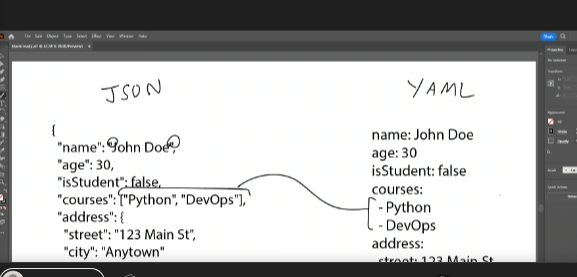

### Differences

JSON does not require indentation but uses speech marks and curly braces

### complete task on scrum board

In groups of 2-3, create a script that converts Valid JSON to Valid YAML.

Create a new Python file json2yaml.py for this task.

Valid JSON:

{
  "name": "John Doe",
  "age": 30,
  "isStudent": false,
  "courses": ["Python", "DevOps"],
  "address": {
    "street": "123 Main St",
    "city": "Anytown"
  }
}

Valid YAML:

name: John Doe
age: 30
isStudent: false
courses:
  - Python
  - DevOps
address:
  street: 123 Main St
  city: Anytown

Starting code:

import json
import os
import sys
import yaml

# Checking there is a file name passed
if len(sys.argv) > 1:
    # Opening the file
    if os.path.exists(sys.argv[1]):
        source_file = open(sys.argv[1], "r")
        source_content = json.load(source_file)
        source_file.close()
    # Failing if the file isn't found
    else:
        print("ERROR: " + sys.argv[1] + " not found")
        exit(1)
# No source file specified
else:
    print("ERROR: No JSON file was specified")
    print("Usage: json2yaml.py <source_file.json> <target_file.yaml>")

# 1. Convert the JSON to YAML - use yaml library
# WRITE YOUR CODE HERE

# 2. Save the YAML into a new file with the name for it received as a argument
# 2.1 Check the target file name was specified as an argument, if not, output the YAML to the screen instead
# WRITE YOUR CODE HERE

# 2.2 Check the target file doesn't already exist
# WRITE YOUR CODE HERE

# 2.3 If previous conditions not met, then save YAML file
# WRITE YOUR CODE HERE
You need to find a way to convert the JSON object to a YAML object and then save that YAML in a new target YAML file (name of YAML file is specified as an argument by the user)

We will talk through it on xxx so be ready to present your solution!

Hints:

The method you need may involve “dumping”
Before you can import yaml, you may need to install the pyyaml module with this command: pip install pyyaml
Get the groups to let you know if they complete the task. At the 60 minute mark bring everyone back and talk through the completed code.

Post a link to this task in the chat at COB