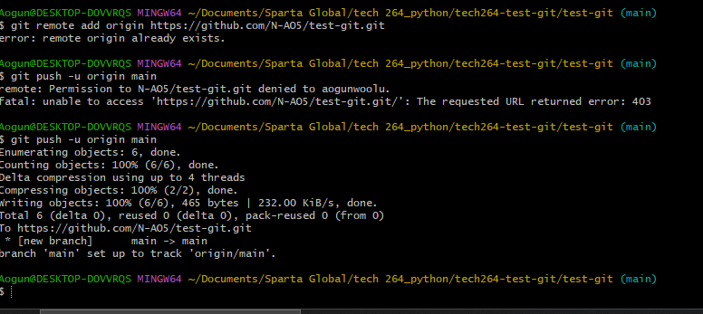

### Task 1: Git 

Creating a git repository:

- ls = list 
- cd ... = open directory
- mkdir ... = make directory
- git init = initialise a git repository
- git status = any commit? and untracked files?
- git add ...= get a file ready to be commited
- git add . =all the files in the directory
- git commit - mg"..." = commit with a message
- git log = show commits starting from the latest at the top 
- git log --oneline = id for commits
- git diff *commit id 1* *commit id 2* = show changes in commits

    - can only compare from one commit to the next

- git checkout *commit id* = go to the commit id'd (previous commit)
- git checkout master = to go back to latest commit (master)
- git checkout *commit id* -- file*1*/to/restore file*2*/to/restore = to restore a specific file to its state in a previous commit
- git checkout HEAD~1 -- ... = (head reference) restore a specific file to the state it was in in a previous commit without referencing the file
    - git head is always at the latest commit, go to the commit before the latest commit
    - the 1 can be 2, 3 etc counting back from the head commit
    - if you get a detached head message it is because the head is pointing to specific commit and not the latest branch


- how to add local to remote repo - make sure your local repo is named the same as the remote one

   -  git branch -M main = change the master branch name to main bc github prefers it named that way
   -  git remote add origin *https . . .* = add the origin you want to push the commit to
   -  git push -u origin main = push a repo from your local command line to a remote 
  
     ***ignore the fatal message***
- 

### Task 2: PyCharm/Python
[variables_examples.py](..%2FPython_learning_project_1%2FVariables%2Fvariables_examples.py)

Use PyCharm/Python to the following subtasks: 

- Aim to have working code for each subtask 
- Document once you have it working - could be as simple as adding comments to each section of code 


If you need to explain, research and document accordingly.

Here are the subtasks: 

- Explain: What is a variable

***A variable is a reference for data that can be used through a programme. They can reference different types of values like numbers or strings.***


- Explain: Why called a variable?

***The values can change a different points in time. The data held by the variable can be changed or reassigned.***


- In your Python learning project, create a folder called 'variables', then create a new file called 'variables_examples.py' for the following tasks 
- Set/assign a variable
    - Try to set a variable with a number value
    - Try to set a variable with a decimal value
    - Try to set a variable with a string value
  
````
#Set a variable with a number value
bananas = 25
#Set a variable a=with a decimal value
Weight = 70.5
#Set a variable with a string value
day = "thursday"
````
  - How is using '==' different?

***It is a comparison of two values, if it returns true then they are equal, if false, they are not.
one equals sign "signs a variable" and a double equals is a comparison operator***


- Explain: What's the difference between a dynamically typed language (like Python) and a strong typed language

***Dynamic variables means the variables can be determined at runtime, python will infer the type based on the value assigned to the variable.***


***Strongly typing means that once a variable is assigned as a data type and must adhere to that type, you have to put in the data type***.

- Give an example of how they are different


````
a = 1          # a is an interger


a = "test"     # a is a string 
````

but with strong typing an error will occur as the language will not adjust to the change in type of class.

- **Print the data types of the variables you set values for above**
```
print(type(a)) #output = <class 'int'>
print(type(a))  #output = <class 'str'>

```
- Overwrite the value of one of your variables which stores a number
     - Check the id() of the variable before and after you overwrite the variable with a new number
  - Why does the 'id' of the variable change?

***The id changes because it is unique to the object it currently is, the value is assigned to the memory of the value the object was assigned so it creates a new object with a new id***
- Ask the user for some input and print the input to the screen

 ```
#ask the user for some input and print the input
user_input = input("please enter some input")
#print the input
print("some input!", user_input)

#another example
age= input ("enter_your_age")
print("you are",age ,"user_input")

```
###  Task 3: Understanding data types
- Explain and demonstrate: Numeric data types: int and float

- Explain and demonstrate: Boolean data type
- Explain why the result is not 0.9999999... with this code and what lesson we should learn:


```

One_third = 1 / 3

 

print(One_third)

# Python should show 0.3333333333333333

print(One_third * 3)

# python rounds it to 1.0

```
### Task 4: Understanding Operators
Explain: What is the difference between an operator and operand?

An operator is a symbol only and an operand is the value that the operator acts on.

Here is your starting code:

````
x = 5

y = 1

````

- Add code to demonstrate that you understand how use operators to:
add
  - subtract
````
x = 5
y = 1
result = x - y
print(result)
#result 5
````
  - multiply
````
x = 5
y = 1
result = x * y
print(result)
#result 5
````
  - divided
````
x = 5
y = 1
result = x / y
print(result)
#result 5.0
````
  - find the remainder part of the division, otherwise known as modulus
````
x = 5
y = 1
remainder = x % y
print(remainder)
#result 0
````
- Add code to demonstrate that you understand how use comparison operators to:
   * greater than
   * less than
   * check if equal
   * check if not equal
   * greater than or equal to
   * less than or equal to
  
````
# values
a = 5
b = 1

# 1. Greater than (>)
print(f"Is {a} greater than {b}? ->", a > b)  # Output: False

# 2. Less than (<)
print(f"Is {a} less than {b}? ->", a < b)  # Output: True

# 3. Equal to (==)
print(f"Is {a} equal to {b}? ->", a == b)  # Output: False

# 4. Not equal to (!=)
print(f"Is {a} not equal to {b}? ->", a != b)  # Output: True

# 5. Greater than or equal to (>=)
print(f"Is {a} greater than or equal to {b}? ->", a >= b)  # Output: False

# 6. Less than or equal to (<=)
print(f"Is {a} less than or equal to {b}? ->", a <= b)  # Output: True
````
### Task 5: Find out what happens when you convert a string to a boolean
Answer these questions:

- When does a string convert to False?
- When does a string convert to True?
- Write a piece of Python code to prove your answers.

 A string coverts to a true/false statement when the string is empty and true when it is non-empty
 ````
 # Empty string
empty_string = ""

# Non-empty strings
non_empty_string = "Hello"
space_string = " "  # A string with just a space

print(f"Is an empty string considered True? -> {bool(empty_string)}")  # Output: False
print(f"Is a non-empty string considered True? -> {bool(non_empty_string)}")  # Output: True
print(f"Is a space string considered True? -> {bool(space_string)}")  # Output: True
````

### Task 5: Understanding 'none' in python
- What is None in Python?

***none is an absence of value***

- When is it commonly used?

***mostly used for initialisation value for functions that don't return anything, as a placeholder for missing data or to signify the end of iteration (eg. finding nothing)***

- What's the equivalent in some other programming languages?

***Java: null***

***C/C++: NULL***


***Ruby: nil***

- Most important: What happens when you convert None to a boolean?

***the result is false as none is equivalent to absence of value***

- how to check if a variable is 'None'

***print(x is none)***

- Write a piece of Python code to prove 
- Write a piece of Python code to
1. assign x to be None

2. print whether my variable x is equal to None

````
#1.
z = bool(None)
print(z) # output False
````
````
2.
x = None

if x is None:
    print("x is None")
else:
    print("x is not None")
    
    #output x is none
````
### Task 7: Boolean methods for strings

Find out what is needed using the comments as a guide. Each of the methods used below should return a boolean (True or False only).

You are not allowed to use any 'if' statements.

Code to get you started:
````
 

hi = "Hello World!"

 

# find out if 'hi' is made up of letters only (use one of the strings methods) - print the boolean to the screen

 print(hi.isalpha()) #output False

# find out if 'hi' is made up only of lowercase letters (use one of the strings methods) - print the boolean to the screen

 print(hi.islower()) #output False


# find out if 'hi' is made up only of uppercase letters (use one of the strings methods) - print the boolean to the screen

 print(hi.isupper()) #output False


# find out if 'hi' ends with an exclamation mark (use one of the strings methods) - print the boolean to the screen

 print(hi.endswith("!")) #output True

# find out if 'hi' starts with a capital "h" (use one of the strings methods) - print the boolean to the screen

print(hi.startswith("H")) #output True
````

**for the assessment, be familiar with most used methods**

### Task 8: Create strings and use quotes appropriately

Starting code:

```
bad_string = 'I said 'Wow!'

print(bad_string)
```
- Explain: Why does this fail?

 ***the quotes used to describe the string must be "", can use single or double quotes that a match***

- Find 3 ways to make this string assignment work
    - Condition: The Wow! must be surrounded in quotes when it prints to the screen
  
    ***the backslash makes it treat the character following the backslash treats the quote as an literal quote rather than a special character quote***
````
good_string = 'I said \'Wow!\''
print(good_string) #output I said 'Wow!' 

good_string = "I said \"Wow!\"'
print(good_string) #output I said 'Wow!' 

good_string = "I said "Wow!"'
print(good_string) #output I said 'Wow!' 

````

- Explain: What is best practice when deciding what quotes to use around strings in Python?

 ***There is no agreed way to use around strings- all about preference, but double quotes are better for readablity than using a backslash***

### Task 9: Slice strings
Explain: What is slicing strings? 

Here is your starting code. You may need to: 

Write code to do what the comments ask for. 
Write a comment to explain what the code does. 

``` 

Hw = "Hello world!" 

print(Hw) 
```

- Find out how many characters Hw has 
***len(string_name) counts the characters including spaces and special characters***
````
hw = "Hello world!"

number_characters = len(hw) #find the number of charcters

print (number_characters)   #output 12
````

- Get the character in the first position in Hw 
  ***Indexing is used and strings in python are zero-indexed meaning the first character is at index 0***
 ````
hw = "Hello world!"


first_char = hw[0] #the character in the first position

#Print the first character

print (first_char)     #output H
````
- Get the last character 

***the last character is hw[-1]***
 
````
hw = "Hello world!"


last_char = hw[-1] # the character in the last position


#Print the last character
print (last_char) #output !
````

-Get the 2nd last character 
````
hw = "Hello world!"


second_to_last_char = hw[-2] # the character in the second to last position


#Print the second to last character
print (second_to_last_char) #output d
````

- Write a comment to EXPLAIN what does this do 

```print(Hw[2:]) # output llo world! ```

 ***This is a slice operation which means it extracts a substring starting at index 2, the second letter, up to the end of the string***
 

- Write a comment to EXPLAIN what does this do 

***This is a slice operation that will return the last 3 characters***

```print(Hw[-3:]) # output ld! ```

 
- Write a comment to EXPLAIN what does this do 

***This is a slice operation that will start from the beginning of the string and include all 5 characters stopping and not including the characters at index 5*** 

```print(Hw[:5]) # output Hello```

***using len() can stop you from going out of the limits of a string?

- Starts from the second, stops at the fifth (doesn't include it) 

 ```print(hw[1:5]) #outout ello```

### Task 10: Use the string methods

Trim spaces off the beginning and end of a string: 

Starting code:
``` 

str_with_extra_spaces = "   extra spaces at the start and end   " 
```
-  Write comment to explain what this does 
```
print(len(str_with_extra_spaces)) #output 39
```

***This prints the number of characters in the string, including the spaces***


- Write comment to explain what this does 

```
print(len(str_with_extra_spaces.strip())) #output 33
``` 

***The .strip removes the extra spaces in the beginning and end of the string and the len() counts the number of characters***

 

- Next, use this new starting code for the next set of subtasks. Write code to do what the comments ask for. 
```
example_text = "here's some text with some words of text" 
```
 

-count how many times the substring 'text' occurs within example_text & print it to the screen 

````
example_text = "here's some text with some words of text"
substring = "text"

count = example_text.count(substring)
print(count)            #output 2

````

 

- convert example_text to lowercase & print it to the screen 

 ````
example_text = "here's some text with some words of text"

lower_example = example_text.lower()

print(lower_example)        #output here's some text with some words of text
````

 

- convert example_text to uppercase & print it to the screen 

````
 example_text = "here's some text with some words of text"

upper_example = example_text.upper()

print(upper_example)   #output HERE'S SOME TEXT WITH SOME WORDS OF TEXT
````
 

- capitalise the first letter in example_text & print it to the screen 

````
 example_text = "here's some text with some words of text"

capitalised_example = example_text.capitalize()

print(capitalised_example)    #output Here's some text with some words of text

 ````

- replace the word 'with' in example_text with a comma (,) instead & print it to the screen 

``` 
example_text = "here's some text with some words of text"

comma_example = example_text.replace(" with", ",")

print(comma_example)    #output here's some text, some words of text
```

### Task 11: Concatenate these variables with different data types

- Explain: What is concatenation? Give a simple example with your code.

***The joining of two or more strings***


Your starting code:

```
x = 2

y = 5.4

z = "there's now a number 25.4 unless we put a space in!"

print(x + y + z)

```

- This should not work.
Make it work:
Make the print statement work using concatenation (+) to join x, y and z so that it prints this to the screen: `25.4 there's now a number 25.4 unless we put a space in!"

Explain: The problem and the solution
 
````
x = "2"

y = "5.4"

z = "there's now a number 25.4 unless we put a space in!"

print(x + y + " " + z) 

#output 25.4 there's now a number 25.4 unless we put a space in!

````
***The problem was that strings were not define correctly with "" and therefore when
they were concatenated there was an error. This corrected by adding double marks around the 
strings and a space was added***

### Task 12: Use f-strings to format numbers

***f-strings is formatted string literals***

Code to get you started:

```
pi = 3.14159265359
```

- Use an f-string to print pi to 3 decimal places e.g. 'Pi to 3 decimal places: <value>'

````
 pi_3dp = f"pi to 3 decimal places = : {pi:.3f}"
print(pi_3dp)  #output pi to 3 decimal places = 3.142
````

- Use an f-string to print pi to 5 decimal places e.g. 'Pi to 5 decimal places: <value>'

 ````
pi_5dp = f"pi to 5 decimal places: {pi:.5f}"
print(pi_5dp)  #output pi to 5 decimal places: 3.14159
````

- Use an f-string to print 'score_as_decimal' e.g. 'You scored 0.6153846153846154' (no % sign)

score = 16

max_score = 26

score_as_decimal = score/max_score

````
score = 16

max_score = 26

score_as_decimal = f"you scored {score/max_score}"
print(score_as_decimal)  #output you scored 0.6153846153846154
````

- Use an f-string to print 'score_as_decimal' formatted as a percentage e.g. 'You scored 61.538462%'

````
 score = 16

max_score = 26


#using the f string to do the formatting
print(f'You scored {score_as_decimal:%}')

#manualling fromatting myself
score_as_decimal = f"you scored {(score/max_score)*100}%"

print(score_as_decimal)  #output you scored 61.53846153846154%
````

- Use an f-string to print 'score_as_decimal' formatted as a percentage to rounded to 2 decimal places e.g. 'You scored 61.54%'
````
 score = 16

max_score = 26

#using the f string to do the formatting
print(f'You scored {score_as_decimal:.2%}')
#manualling fromatting myself
score_as_decimal_2dp = f"you scored {(score/max_score)*100:.2f}%"


print(score_as_decimal_2dp) #output you scored 61.54%
````

- Use an f-string to print 'score_as_decimal' formatted as a percentage to rounded to a whole number e.g. 'You scored 62%'

```
score = 16

max_score = 26

#using the f string to do the formatting
print(f'You scored {score_as_decimal:0%}')
#manualling fromatting myself
score_as_decimal_whole = f"you scored {(score/max_score)*100:.0f}%"

print(score_as_decimal_whole)   #output you scored 62%
```

### Task 13: convert/cast this string to an int and float

- Do what is written in the comments.

Starting code:

```

int_string = "6"

 ```

- convert int_string to an integer

````

int_string = "6"

int(int_string)

print(int_string) #output 6

````

- after converting, print its data type to the screen

````
int_string = "6"
converted_int = int(int_string)

print(type(converted_int))  #output <class 'int'>

````
 

- convert int_string to float

````
 int_string = "6"
converted_float = float(int_string)
print(converted_float) #output 6.0

````
- after converting, print its data type to the screen

```
int_string = "6"
converted_float = float(int_string)
print(type(converted_float))  #output <class 'float'>

```
