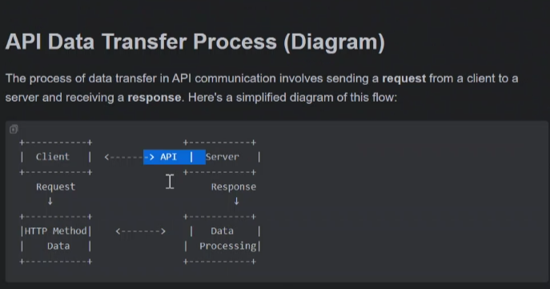
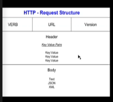
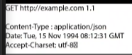
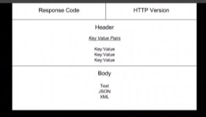

### API RESEARCH

what are APIS and why are they popular?
- set of rules and practicals 
- main use is to get data from a sever
- API represents the resources that we're trying to access, gives you access to do API methods (POST, GET, PATCH, DELETE) 
- POST can also be used to req specific information but "request.get(https)" is more often used
- Many types eg REST API

- clients: sent a request using HTTPS methods like GET or POST
- Server: receives the request, processes data and sends back a response

####  REST API

- now the more common type of API
- Uses HTTP/HTTPS methods (a way of encrypting information from client to server)
- stateless: each req from client to the server must contain all the info for the server to fulfil the req, stateful keeps track of the users session ao authentication is stored on the servers, stateless does not
- uniform
- client- server
- cachable - storing copies of files or data as temporary storage, if you make the same req for the same info, caching means it has the information ready to go
- layered system

request structure
- verb, the method:
  - GET read request
  - POST create
  - PUT updating record, a complete replace a record on the server
  - PATCH modify a specific part of a record on the server
  - DELETE deletes 
- the URL, in quote marks, where is this methods going

- version, the version of https
- you receive a header (in key value pairs) and body (in json)

response structure
- there is a response code (200.201.400,401)
- and a http version

- first bit- header
- in the {}, the json is the body

#### What is HTTPS?
- Hypertext transfer protocol  - secure